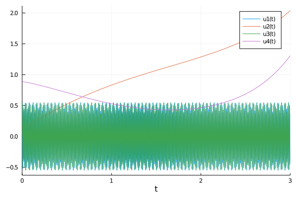

# HOODESolver.jl

*A Julia package for solving numerically highly-oscillatory ODE problems*

[](https://ymocquar.github.io/HOODESolver.jl/stable)
[](https://ymocquar.github.io/HOODESolver.jl/dev)
[](https://github.com/ymocquar/HOODESolver.jl/actions)
[](https://codecov.io/gh/ymocquar/HOODESolver.jl)
[](https://opensource.org/licenses/MIT)

## Installation

HOODESolver.jl is a registered package and can be installed using the Julia package manager. From the Julia REPL, enter Pkg mode (by pressing `]`)

```julia
julia>]
(@v1.5) pkg> add HOODESolver
```

## Usage

The following is an example with the system of Hénon-Heiles. Please see the [documentation](https://ymocquar.github.io/HOODESolver.jl/stable/) for further usage, tutorials, and api reference.

```julia
using HOODESolver
using Plots

A = [ 0 0 1 0 ; 
      0 0 0 0 ; 
     -1 0 0 0 ; 
      0 0 0 0 ]

fct = (u,p,t) ->  [ 0, u[4], 2*u[1]*u[2], -u[2] - u[1]^2 + u[2]^2 ] 

epsilon= 0.0001

t_min=0.0
t_max=3.0

u0 = [0.55, 0.12, 0.03, 0.89]
prob = HOODEProblem(fct, u0, (t_min,t_max), missing, A, epsilon); 
```

solve the defined problem

```julia
sol = solve(prob) 
plot(sol) 
```


## Contributing and Support

For support with using HOODESolver.jl, please open an [issue](https://github.com/ymocquar/HOODESolver.jl/issues/new/) describing the problem and steps to reproduce it.

## License

This package is licensed under the MIT Expat license. See [LICENSE](LICENSE) for more information.
