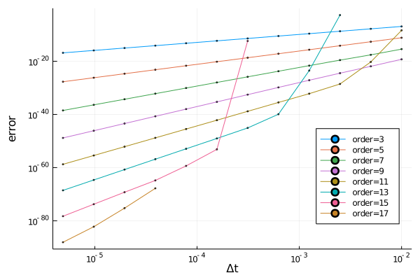
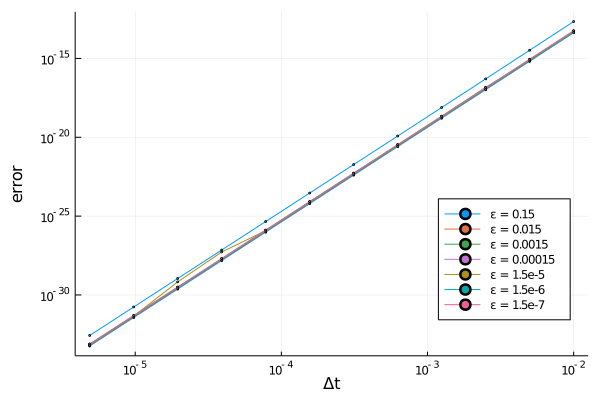
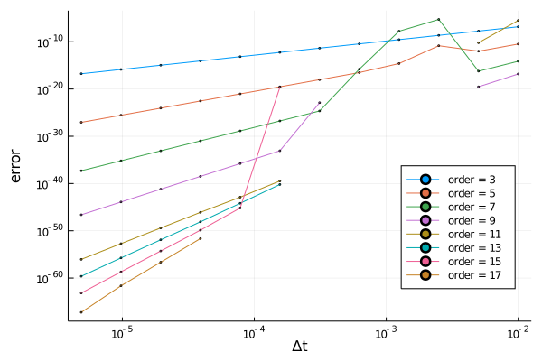
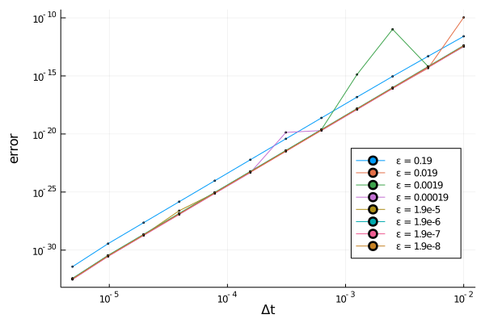

# Quickstart

## Hénon-Heiles Example

We consider the system of Hénon-Heiles satisfied by $u(t)=(u_1, u_2, u_3, u_4)(t)$.

$$\frac{d u }{dt} = \frac{1}{\varepsilon} Au + f(u), \;\;\; u(t_{start})=u_{inn}\in\mathbb{R}^4,$$

where $A$ and $f$ are selected as follows

$$A=
\left(
\begin{array}{cccc}
0 & 0 & 1 & 0  \\
0 & 0 & 0 & 0  \\
-1 & 0 & 0 & 0  \\
0 & 0 & 0 & 0  
\end{array}
\right) \;\;\;\; \text{ and } \;\;\;\;
f(u) = \left(
\begin{array}{cccc}
0 \\
u_4\\
-2 u_1 u_2\\
-u_2-u_1^2+u_2^2
\end{array}
\right).$$

one chooses for example, $\varepsilon=0.001$
and $u_{in} = (0.12, 0.12, 0.12, 0.12)$

```@setup 1
using Plots
```

## Input parameters

The input arguments use the same format as the ODE package. 

Thus, first of all, we must define the arguments necessary to construct the problem (1), namely

- the $f$ function (in the form *Julia*) 
- the initial condition $u_{in}$.
- the initial time $t_{start}$ and final time $t_{end}$. 
- the second parameter of the 
- the $A$ matrix 
-  $\varepsilon \in ]0, 1]$

```@example 1
using HOODESolver

A = [ 0 0 1 0 ; 
      0 0 0 0 ; 
     -1 0 0 0 ; 
      0 0 0 0 ]

f1 = LinearHOODEOperator( epsilon, A)

f2 = (u,p,t) ->  [ 0, u[4], 2*u[1]*u[2], -u[2] - u[1]^2 + u[2]^2 ] 

epsilon= 0.0001

tspan = (0.0, 3.0)

u0 = [0.55, 0.12, 0.03, 0.89]

prob = SplitODEProblem(f1, f2, u0, tspan);
nothing # hide
```

From the ```prob``` problem, we can now switch to its numerical resolution. 

To do this, the numerical parameters are defined 
- the number of time slots $N_t$ which defines the time step $\Delta t = \frac{t_{\text{end}}-t_{start}}{N_t}$ 
- the $r$ order of the method 
- the number of $N_\tau$ points in the $\tau$ direction... 
- the order of preparation $q$ of the initial condition 

The default settings are : $N_t=100$, $r=4$, $N_\tau=32$ and $q=r+2=6$
To solve the problem with the default parameters, just call the `solve` command with the problem already defined as parameter
```jl     
sol = solve(prob, alg=HOODEAB()) 
```
Which is equivalent to this call
```jl     
sol = solve(
    prob;
    nb_tau=32, 
    order=4, 
    order_prep=6, # by default : order + 2
    dense=true, 
    nb_t=100, 
    getprecision=true, # by default : dense 
    verbose=100,    
    par_u0=missing,
    p_coef=missing,
) 
```

### Exhaustive definition of the parameters

- `prob` : problem defined by `HOODEProblem` 
- `nb_tau=32` : $N_{\tau}$
- `order=4` : order $r$ of the method
- `order_prep=order+2` : order of preparation of initial data
- `dense=true` : indicates whether or not to keep the data from the fourier transform, if `dense=false`, processing is faster but interpolation can no longer be done.
- `nb_t=100` : $N_t$
- `getprecision=dense` : indicates whether the accuracy is calculated, the method used to calculate the accuracy multiplies the processing time by 2.
- `verbose=100` : trace level, if `verbose=0` then nothing is displayed.
- `par_u0` : If we have to make several calls to `solve` with the same initial data and in the same order, we can pass in parameter the already calculated data.
- `p_coef` : table with the coefficients of the Adams-Bashforth method. This array can be used to optimize several calls with the same parameters.

## Exit arguments

As an output, a structure of type `HOODESolution`.
This structure can be seen as a function of t, it can also be seen as an array of size $N_t + 1$. This structure also contains the `absprec` and `relprec` fields which are the absolute and relative precisions, respectively, calculated.

### Example

```@repl 1     
sol = solve(prob);
t=2.541451547
sol(t)
sol[end]
sol(3.0)
sol.absprec
sol.relprec
```

To view the result, you can also use Plot, for example

```@example 1     
using Plots
plot(sol) 
```

## Linear non-homogeneous case 

The following non-homogeneous linear system is considered to be satisfied by $u(t)=(u_1, u_2, u_3, u_4)(t)$

```math
\frac{d u }{dt} = \frac{1}{\varepsilon} Au + f(t, u), \;\;\; u(0)=u_in\in\mathbb{R}^4,
```

where ``A`` and ``f`` are selected as follows

```math
A=
\left(
\begin{array}{cccc}
0 & 0 & 1 & 0  \\
0 & 0 & 0 & 0  \\
-1 & 0 & 0 & 0  \\
0 & 0 & 0 & 0  
\end{array}
\right) \;\;\; \text{ and } \;\;\;
f(t, u) = Bu +\alpha t +\beta \;\; \text{ with  } \;\;
B\in {\mathcal M}_{4, 4}(\mathbb{R}), \alpha, \beta \in \mathbb{R}^4,
```

``B, \alpha, \beta`` are chosen randomly.

We wish to obtain a high precision, so we will use BigFloat real numbers, they are encoded on 256 bits by default which gives a precision bound of about ``2^{-256}. \approx 10^{-77}``.  At the end, we compare a calculated result with an exact result.

```@setup 2
using HOODESolver
using Plots
using Random
```

```@example 2

rng = MersenneTwister(1111)

A=[0 0 1 0 ; 0 0 0 0 ; -1 0 0 0 ; 0 0 0 0]
B = 2rand(rng, BigFloat, 4, 4) - ones(BigFloat, 4, 4)
alpha = 2rand(rng, BigFloat, 4) - ones(BigFloat, 4)
beta = 2rand(rng, BigFloat, 4) - ones(BigFloat, 4)
fct = (u,p,t)-> B*u + t*p[1] +p[2]
u0 = [big"0.5", big"-0.123", big"0.8", big"0.7"]
t_start=big"0.0"
t_end=big"1.0"
epsilon=big"0.017"
prob = HOODEProblem(fct, u0, (t_start,t_end), (alpha, beta), A, epsilon, B)
sol = solve(prob, nb_t=10000, order=8)
sol.absprec
```

```@example 2
t=big"0.9756534187771"
sol(t)-getexactsol(sol.par_u0.parphi, u0, t)
```

```@example 2
plot(sol.t,sol.u_tr)
```

### Calculation of the exact solution

This involves calculating the exact solution $u(t)$ of the following equation at the instant $t$

```math
\frac{d u }{dt} = \frac{1}{\varepsilon} Au + Bu +\alpha t +\beta, \;\;\; u(t_{start})=u_{in}\in\mathbb{R}^4\text{, } A \text{ and }B \text{ are defined above }
```

Let

```math
\begin{aligned}
    M &= \frac{1}{\varepsilon} A + B\\
    C &= e^{-t_{start} M}u_{in} +M^{-1} e^{-t_{start} M} (t_{start}\alpha+\beta)+ M^{-2} e^{-t_{start} M} \alpha\\
    C_t &= -M^{-1} e^{-t M} (t\alpha+\beta)-M^{-2} e^{-t M} \alpha\\
    u(t) &= e^{t M} ( C + C_t)
\end{aligned}
```

Which, translated into Julia language, gives the code of the function `getexactsol` : 

```julia
function getexactsol(par::PreparePhi, u0, t)
    @assert !ismissing(par.matrix_B) "The debug matrix is not defined"
    sparse_A = par.sparse_Ap[1:(end-1),1:(end-1)]
    m = (1/par.epsilon)*sparse_A+par.matrix_B
    t_start = par.t_0
    if ismissing(par.paramfct)
        return exp((t-t0)*m)*u0
    end
    a, b = par.paramfct
    mm1 = m^(-1)
    mm2 = mm1^2
    e_t0 = exp(-t_start*m)
    C = e_t0*u0 + mm1*e_t0*(t_start*a+b)+mm2*e_t0*a
    e_inv = exp(-t*m)
    e = exp(t*m)
    C_t = -mm1*e_inv*(t*a+b)-mm2*e_inv*a
    return e*C+e*C_t
end
```

## Accuracy of the result according to the time interval

### Linear problem

From a problem of the previous type, as long as we can calculate the exact solution, it is possible to know exactly what the error is.
The initialization data being

```jl
using HOODESolver

A = [0 0 1 0 ; 0 0 0 0 ; -1 0 0 0 ; 0 0 0 0]

u0 = BigFloat.([-34//100, 78//100, 67//100, -56//10])

B = BigFloat.([12//100 -78//100 91//100 34//100
    -45//100 56//100 3//100 54//100
    -67//100 09//100 18//100 89//100
    -91//100 -56//100 11//100 -56//100])

alpha =  BigFloat.([12//100, -98//100, 45//100, 26//100])

beta =  BigFloat.([-4//100, 48//100, 23//100, -87//100])

epsilon = 0.015

t_end = big"1.0"

fct = (u,p,t)-> B*u + t*p[1] +p[2]

prob = HOODEProblem(fct,u0, (big"0.0",t_end), (alpha, beta), A, epsilon, B)
```

Note that the floats are coded on 512 bits.\
By varying $\Delta t$ from $10^{-2}$ to $5.10^{-6}$ (i.e. `nb_t` from `100` to `204800`) on a logarithmic scale, for odd orders from 3 to 17 we get these errors

#### Precision of the result with ε = 0.015



Now with the same initial data, order being setted to 6, and $\varepsilon = 0.15, 0.015, \ldots, 1.5\times 10^{-7}$.\
Here floats are coded on 256 bits.

#### Precision of the result with order = 6



### Problem with Hénon-Heiles function

```jl
u0=BigFloat.([90, -44, 83, 13]//100)
t_end = big"1.0"
epsilon=big"0.0017"
fct = u -> [0, u[4], -2u[1]*u[2], -u[2]-u[1]^2+u[2]^2]
A = [0 0 1 0; 0 0 0 0;-1 0 0 0; 0 0 0 0]
prob = HOODEProblem(fct, u0, (big"0.0",t_end), missing, A, epsilon)
```
The float are coded on 512 bits.

#### Precision of the result with ε = 0.0017



Now with the same initial data, order being setted to 6, and $\varepsilon = 0.19, 0.019, \ldots, 1.9\times 10^{-8}$.\
Here floats are coded on 256 bits.

#### Precision of the result with ordre = 6


